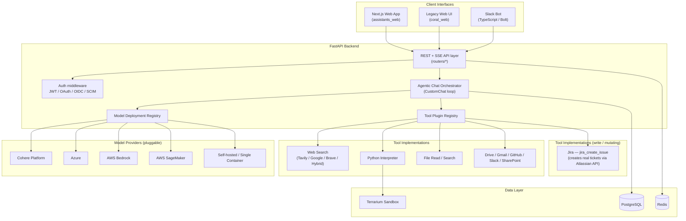
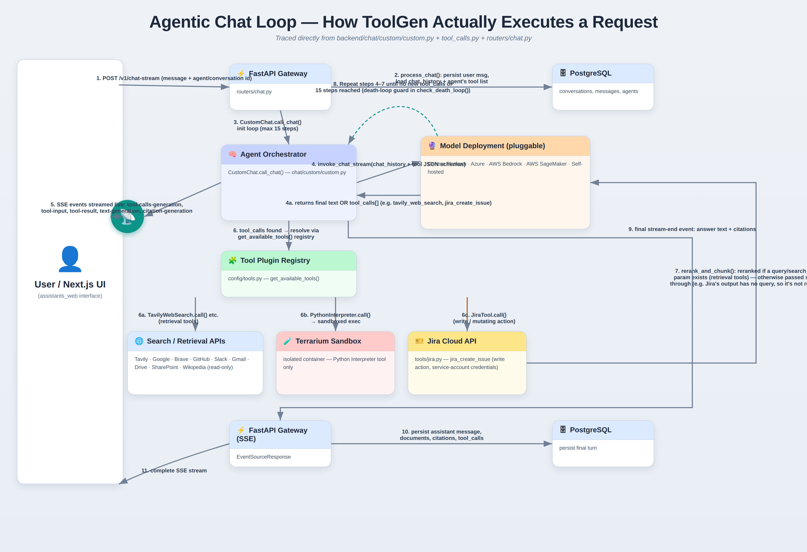
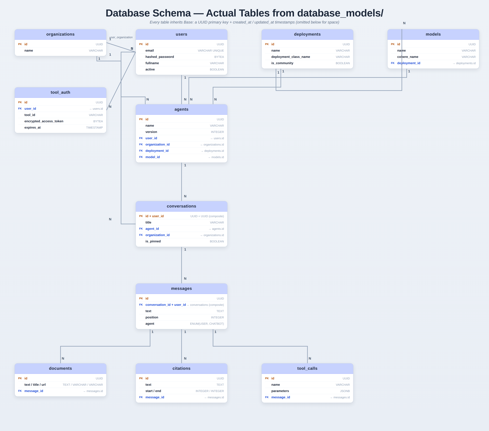

# ToolGen — A Self-Hosted, Agentic RAG Platform (Personal Learning Clone of Cohere Toolkit)

> **📌 Attribution & purpose (read this first):** ToolGen is my personal clone of [Cohere's open-source `cohere-toolkit`](https://github.com/cohere-ai/cohere-toolkit) (MIT licensed). I cloned, deployed, and did a deep line-by-line study of the codebase to learn how a production-grade, multi-tenant, agentic RAG application is actually built — request routing, an LLM tool-calling loop, retrieval + reranking, a pluggable model/tool architecture, auth, and multi-cloud deployment. All original design and code credit belongs to Cohere and its contributors (see `CODEOWNERS`). I did **not** design this system from scratch — I use this repo, and this README, as a study artifact and as evidence that I can read, run, and reason about a large real-world codebase. Any customizations I made on top of the base repo are called out explicitly in **[My Contributions](#my-contributions)** below.

---

## Table of Contents
1. [What This Project Is](#what-this-project-is)
2. [Why I Built This](#why-i-built-this)
3. [Key Features](#key-features)
4. [Tech Stack](#tech-stack)
5. [System Architecture](#system-architecture)
6. [Core Workflow: The Agentic Chat Loop](#core-workflow-the-agentic-chat-loop)
7. [Database Schema](#database-schema)
8. [The Plugin Architecture (Tools & Model Providers)](#the-plugin-architecture-tools--model-providers)
9. [Auth & Multi-Tenancy](#auth--multi-tenancy)
10. [Deployment Options](#deployment-options)
11. [Getting Started Locally](#getting-started-locally)
12. [Testing](#testing)
13. [Design Decisions & Trade-offs (Interview Notes)](#design-decisions--trade-offs-interview-notes)
14. [My Contributions](#my-contributions)
15. [What I'd Improve Next](#what-id-improve-next)
16. [Credits & License](#credits--license)

---

## What This Project Is


ToolGen is a full-stack, deployable **Retrieval-Augmented Generation (RAG) platform**. Instead of just wrapping a single chat completion call, it runs a full **agentic loop**: the LLM decides which tools it needs (web search, a Python sandbox, file search, Google Drive, Gmail, GitHub, Slack, SharePoint, etc.), the backend executes those tools, reranks and chunks the results, feeds them back to the model, and repeats until the model is ready to answer — all while streaming events to the client over Server-Sent Events (SSE).

It ships with three client interfaces (a Next.js web app, a legacy web UI, and a Slack bot), a FastAPI backend, Postgres for persistence, Redis for caching, and a sandboxed code-execution container (**Terrarium**) for the Python interpreter tool. It supports five model-provider backends (Cohere's hosted API, Azure, AWS Bedrock, AWS SageMaker, and a self-hosted "single container" option) behind one common interface, and it's deployable to AWS, Azure, GCP, or plain Docker Compose.

## Why I Built This

I wanted hands-on experience with the pieces that show up in real production LLM systems but rarely appear in tutorial-sized projects:
- An actual **tool-calling / agent loop** with loop termination, timeouts, and parallel tool execution — not a single-shot prompt.
- A **retrieval pipeline** with chunking and cross-encoder reranking, not just "stuff everything into the prompt."
- A **provider-agnostic abstraction layer** so the same chat logic works across five different LLM backends.
- **Multi-tenant data modeling** (organizations, users, agents, conversations) with proper cascading deletes and composite keys.
- **Config-driven, layered settings** (YAML + env vars) instead of hardcoded values, and multiple auth strategies (JWT, OAuth, OIDC, SCIM).
- **Infrastructure-as-code** for multiple clouds, so I could see how the same app is packaged for AWS ECS/Copilot, Azure Container Apps, GCP Cloud Run, and Kubernetes (Helm).

Cloning and running this end-to-end — and then explaining *why* each piece exists — was the goal, not the size of the codebase itself.

## Key Features

- 🧠 **Agentic tool-calling loop** — the model can chain up to 15 tool-call steps per turn before it must answer.
- 🔍 **Multi-source retrieval** — web search (Tavily / Google / Brave / a "hybrid" aggregator), Wikipedia (via LangChain), file search, and read-only connector tools (Google Drive, Gmail, GitHub, SharePoint, Slack).
- 🎫 **Write-action tooling** — `jira_create_issue` (added by me): the only tool in the registry that *mutates* external state instead of retrieving it — the agent can autonomously file a real Jira ticket mid-conversation. See [My Contributions](#my-contributions) for how it's wired in and its current limitations.
- 🧮 **Sandboxed code execution** — a Python interpreter tool that runs in an isolated container (Terrarium), not in the API process.
- 🔁 **Reranking + chunking pipeline** — tool outputs are split into soft/hard word-count chunks and reranked against the query before being handed back to the model, so only the most relevant passages consume context.
- 🔌 **Pluggable model providers** — Cohere Platform, Azure, AWS Bedrock, AWS SageMaker, self-hosted, and (as an optional "community" package) HuggingFace / local models — all behind one abstract interface.
- 🏢 **Multi-tenancy** — organizations → users → agents → conversations, with a request-scoped query filter that automatically scopes reads by `organization_id`.
- 🔐 **Multiple auth strategies** — JWT with a logout blacklist table, Basic auth, Google OAuth, OIDC, and a SCIM endpoint for enterprise user provisioning.
- 💬 **Three interfaces** — a modern Next.js "assistants" web app, a legacy web UI, and a TypeScript Slack bot (Slack Bolt framework) with thread summarization, RAG-over-uploaded-files, and citation formatting.
- ☁️ **Multi-cloud deployment** — Docker Compose for local dev; Dockerfiles + IaC for AWS (ECS/Copilot), Azure Container Apps, GCP Cloud Run, and a Kubernetes Helm chart.
- 🧩 **Extensible by design** — new tools and model deployments are added by subclassing an abstract base class and registering them; an optional "community" package keeps experimental integrations out of the core.

## Tech Stack

| Layer | Technology |
|---|---|
| Backend API | Python 3.11, FastAPI, Uvicorn, Server-Sent Events (`sse-starlette`) |
| ORM / Migrations | SQLAlchemy 2.0 (typed `Mapped[]` models), Alembic |
| Validation / Config | Pydantic v2, `pydantic-settings` (layered YAML + env-var config) |
| Database | PostgreSQL 14 |
| Cache | Redis 7 |
| Code sandbox | Terrarium (isolated container for the Python-interpreter tool) |
| LLM orchestration | Cohere SDK, LangChain (Wikipedia retriever, community connectors) |
| Dependency mgmt | Poetry |
| Testing | pytest, pytest-xdist (parallel runs), coverage |
| Web frontend | Next.js, TypeScript, Tailwind CSS |
| Slack bot | TypeScript, Slack Bolt SDK, `tsup`, Vitest |
| Containerization | Docker, Docker Compose (`watch` mode for live reload) |
| Cloud deploy | AWS (ECS/Copilot), Azure Container Apps, GCP Cloud Run, Kubernetes (Helm) |
| Auth | JWT (HS256), OAuth2 (Google), OIDC, SCIM |

## System Architecture



**How to read this:** every interface talks to the same FastAPI backend over one API. The backend never calls a model provider or a tool directly — it goes through a **registry** (`get_available_tools()`, the deployment registry) that resolves a string ID to a class implementing a shared abstract interface. That indirection is what makes "add a new tool" or "add a new model provider" a matter of writing one class and registering it, instead of touching the chat logic.

## Core Workflow: The Agentic Chat Loop

This is the heart of the system (`backend/chat/custom/custom.py`, `backend/chat/custom/tool_calls.py`). A single user message can trigger several rounds of "ask the model → run tools → feed results back" before the user sees a final answer — this is a ReAct-style agent loop, capped at 15 steps to prevent infinite tool-call cycles.



*(Diagram built and verified line-by-line against `routers/chat.py`, `chat/custom/custom.py`, and `chat/custom/tool_calls.py` — including the `jira_create_issue` branch I added. Jira is a **write/mutating** action, not a retrieval call, so it has no `query`/`search_query` parameter and `rerank_and_chunk()` passes its output straight through rather than reranking it.)*

Key implementation details worth knowing cold in an interview:
- **Streaming is event-driven.** The backend yields typed events (`stream-start`, `tool-calls-generation`, `tool-input`, `tool-result`, `text-generation`, `citation-generation`, `stream-end`) over SSE, and the loop only forwards the *final* `stream-end` to the client — intermediate ones are filtered out so the UI doesn't flicker between "answer" states.
- **Tool execution is parallelized, not sequential.** If the model requests three tools in one turn, all three run concurrently via `asyncio.gather`, wrapped in a single 60-second timeout.
- **A death-loop guard exists.** `check_death_loop()` compares consecutive tool-call plans/actions so a model that gets stuck repeating the same tool call doesn't burn through all 15 steps silently.
- **Retrieval and generation share one model.** The same deployment object both generates the answer *and* reranks retrieved chunks (`invoke_rerank`), so swapping providers changes both behaviors consistently.

## Database Schema

All tables inherit a common `Base` (UUID string primary key, `created_at`/`updated_at` timestamps, omitted below for space). Below is the core entity relationship model, built directly from `database_models/*.py`:



*(The Jira feature didn't touch this schema at all — `jira_create_issue` has no `auth_implementation`, so unlike the OAuth connectors it doesn't create any `tool_auth` rows. See [Auth & Multi-Tenancy](#auth--multi-tenancy) below.)*

Notable schema decisions:
- **`conversations` uses a composite primary key `(id, user_id)`** rather than a single `id`. Every downstream table (`messages`, `documents`, `citations`, `snapshots`) uses a composite foreign key `(conversation_id, user_id)` back to it. This bakes ownership directly into the foreign-key relationship, so it's structurally impossible to join a message to a conversation owned by a different user.
- **Multi-tenancy is enforced at the query layer, not just the schema.** A custom SQLAlchemy `Query` subclass (`CustomFilterQuery`) reads the current request's `organization_id` from a context variable and automatically filters any query touching a table with an `organization_id` column — so per-request tenant isolation doesn't rely on every developer remembering to add a `.filter()` call.
- **`tool_auth` stores encrypted OAuth tokens per `(user_id, tool_id)`.** Access/refresh tokens are stored encrypted at rest and only decrypted on read via a `@property`.
- **`agents` have a unique constraint on `(name, version, user_id)`**, which is how the system supports versioned, per-user-editable agent configurations without a separate version table.
- **`blacklist` exists purely to support JWT logout** — since JWTs are stateless, logging out means adding the token's `jti` to this table and checking it on every authenticated request.

## The Plugin Architecture (Tools & Model Providers)

Both tools and model providers are implemented as **abstract base classes** with a registry that maps a string ID to an implementation — a classic Strategy pattern:

- **`BaseDeployment`** (`model_deployments/base.py`) defines `invoke_chat`, `invoke_chat_stream`, `invoke_rerank`, `list_models`, `is_available`, and `env_vars`. Five deployments implement it: `CohereDeployment`, `AzureDeployment`, `BedrockDeployment`, `SageMakerDeployment`, `SingleContainerDeployment` — plus community-contributed `HuggingFaceDeployment` and `LocalModelDeployment` behind a feature flag.
- **Tools** are registered in `config/tools.py` as an `Enum` mapping a name to an implementation class (`Calculator`, `PythonInterpreter`, `TavilyWebSearch`, `GoogleDrive`, `GithubTool`, `SlackTool`, `JiraTool`, etc.). A `ParametersValidationMeta` metaclass automatically wraps every tool's `call()` method with parameter validation and (optionally) metrics timing — so individual tool authors don't have to remember to add that boilerplate themselves.
- **Community extensions are opt-in.** A separate `src/community` package (arxiv, PubMed, ClinicalTrials, Wolfram Alpha, a generic LangChain connector) is only imported if `feature_flags.use_community_features` is set — keeping experimental/lower-maintenance integrations out of the core dependency tree (`INSTALL_COMMUNITY_DEPS` build arg controls this at the Docker layer too).

This is the piece I'd point to first if asked "how would you add support for a new LLM provider or a new tool without touching existing chat logic" — the answer is: implement the abstract interface, register it, done.

## Auth & Multi-Tenancy

- **JWT** (HS256, 90-day expiry) is the default session mechanism; a `blacklist` table handles logout for otherwise-stateless tokens.
- **OAuth strategies are pluggable** (`services/auth/strategies/`): `basic`, `google_oauth`, and generic `oidc`, all implementing a shared `BaseAuthStrategy`.
- **SCIM** (`routers/scim.py`) is implemented for enterprise identity-provider user/group provisioning — a detail that signals this was built with real enterprise deployments in mind, not just a demo.
- **Router-level dependency injection** — `config/routers.py` maps each router to a different set of FastAPI `Depends()` based on whether auth is globally enabled, so the same codebase can run fully open (local dev) or fully authenticated (production) without branching logic scattered through route handlers.
- **Not every tool follows the OAuth pattern.** Drive/Gmail/GitHub/Slack authenticate per-user via `tool_auth` (see [Database Schema](#database-schema)) — each user connects their own account, and the token is looked up per request. `jira_create_issue` doesn't: it has `auth_implementation=None` and reads a single set of credentials from environment variables, so every user of an agent with this tool enabled creates tickets under the same Jira service account, not their own identity. That's consistent with how `TavilyWebSearch` and the other global-API-key tools work, but it's a real difference worth being able to explain if asked "does this tool support per-user auth?" — the honest answer is no, not currently.

## Deployment Options

| Target | Mechanism |
|---|---|
| Local dev | `docker compose up` (Postgres, Redis, backend, Next.js frontend, Terrarium sandbox) with `docker compose watch` for live reload |
| AWS | ECS via AWS Copilot (`copilot/`), plus raw `ecs_service.json` |
| Azure | Azure Container Apps / Compose deploy (`azure_compose_deploy/`, `azuredeploy.json`) |
| GCP | Cloud Run (`gcp.backend.Dockerfile`, `gcp.frontend.Dockerfile`, `gcp_postcreate_hook.sh`) |
| Kubernetes | Helm chart (`charts/`) |
| CI | `cloudbuild.yaml` for GCP Cloud Build |

Each cloud target gets its **own Dockerfile** (e.g. `gcp.backend.Dockerfile` vs `azure-api.Dockerfile`) rather than one generic image — a trade-off that favors platform-specific optimization (base image, entrypoint, health checks) over a single "works everywhere" artifact.

## Getting Started Locally

```bash
git clone <this-repo-url>
cd toolgen

# Requires Docker, Docker Compose >= 2.22, and Poetry
make first-run          # builds + starts db, redis, backend, frontend, terrarium
# — or, without the Makefile —
docker compose up
docker compose run --build backend alembic -c src/backend/alembic.ini upgrade head
```

- Web UI: `http://localhost:4000`
- Backend API: `http://localhost:8000` (health check at `/health`)
- Add provider credentials (e.g. `COHERE_API_KEY`) to `src/backend/config/secrets.yaml` before chatting.

## Testing

- **Unit tests:** `make run-unit-tests` → `pytest -n auto` (parallelized) with coverage, against `src/backend/tests/unit` (46 test modules).
- **Integration tests:** `make run-integration-tests` → a separate pytest config/DB (`test_db` service on port 5433) so integration runs don't clobber dev data.
- **Community package tests:** isolated under `src/community/tests`, run separately from core tests.
- **Frontend:** Vitest for both the Slack bot and the Next.js app's unit tests.

## Design Decisions & Trade-offs (Interview Notes)

Questions I'd expect — and how I'd answer them, based on reading the code:

- **"Why cap the tool loop at 15 steps instead of letting the model decide when to stop?"** Because an LLM-driven loop has no natural termination guarantee — a model can get stuck re-issuing similar tool calls. A hard cap plus a death-loop detector (`check_death_loop`) bounds worst-case latency and cost per request.
- **"Why rerank *and* chunk tool outputs instead of passing raw results back to the model?"** Context is expensive and finite. Chunking (soft cutoff ~100 words, hard cutoff ~300, on sentence boundaries) plus reranking against the query means only the most relevant passages consume context tokens, and results below a relevance threshold (0.1) are dropped entirely.
- **"Why abstract the model provider instead of calling the Cohere SDK directly?"** So the orchestration logic (the agent loop, reranking, tool execution) is provider-agnostic. Swapping Cohere for Bedrock or a self-hosted model touches only `model_deployments/`, not `chat/`.
- **"Why a composite primary key on `conversations` instead of a simple UUID?"** It pushes ownership enforcement into the schema itself via composite foreign keys, rather than relying on every query to remember a `WHERE user_id = ...` clause.
- **"Why run the Python interpreter tool in a separate container (Terrarium) instead of `exec()` in the API process?"** Arbitrary code execution requested by an LLM is a security boundary — isolating it in its own sandboxed container limits the blast radius if generated code is malicious or buggy.
- **"Why YAML + environment variables for config instead of just env vars?"** Layered config (`pydantic-settings` with a YAML source plus env-var overrides) lets structured, nested settings (e.g. per-deployment config blocks) live in a checked-in template while secrets stay in env vars / a gitignored `secrets.yaml` — readable defaults, overridable per-environment.
- **"Why JWT with a blacklist table instead of server-side sessions?"** Stateless JWTs scale better across multiple backend replicas without a shared session store — the blacklist table is the one piece of state needed to support logout, kept intentionally minimal.
- **"Your Jira tool reads `os.getenv()` directly — why not use the `Settings()` pattern every other tool uses?"** It doesn't, currently, and that's a real inconsistency I'd fix: `Settings().get('tools.jira.api_token')` would make it configurable the same way as every other tool (via `secrets.yaml`), and it'd show up in `secrets.template.yaml` where new developers actually look. Right now it's an undocumented special case.
- **"What happens if someone enables the Jira tool but forgets to set the credentials?"** Today: it returns a fake success response (a `MOCK-123` issue URL) instead of an error, so the model — and the user — would be told a ticket was created when it wasn't. That's the single thing I'd prioritize fixing before calling this production-ready; it should raise a clear "Jira is not configured" error instead.

## My Contributions

- **Engineered a custom Jira integration tool (`jira_create_issue`):** designed and implemented a tool allowing the LLM agent to autonomously create tickets directly in a Jira Cloud project, following the existing `BaseTool` plugin pattern used by every other tool in the registry.
- **Implemented API authentication & error handling:** wrote the backend logic to authenticate with the Atlassian REST API using environment variables (`JIRA_API_TOKEN`, `JIRA_EMAIL`, `JIRA_DOMAIN`). Built graceful error handling so that if the API rejects a request (e.g., missing project keys or permissions), a structured error is passed back to the model to relay to the user, rather than crashing the backend.
- **Used Pydantic for strict tool-input validation:** defined `JiraCreateIssueInput` (`summary`, `description`, `issue_type`, `priority`) so the model's tool call is validated before it ever reaches the Atlassian API.
- **Manually tested end-to-end against a live Jira board** to confirm ticket creation works from a real conversation, though I haven't yet added an automated test (`test_jira.py`) — the existing core tools like `Calculator` have one in `tests/unit/tools/`, and this is next on my list precisely because manual testing doesn't catch regressions the way the test suite does for everything else.
- Walked the codebase from `main.py` down through the agentic chat loop, the tool registry, and the schema to understand the request lifecycle in full, and deployed the full stack locally via Docker Compose with the Cohere Platform model deployment configured end-to-end.

## What I'd Improve Next

- **Fix the Jira tool's config pattern** — move credentials from raw `os.getenv()` calls into the app's `Settings()`/`secrets.yaml` system that every other tool uses, and document the required env vars in `secrets.template.yaml`.
- **Replace the "mock success" fallback with an explicit error** when Jira credentials aren't configured, so a misconfigured deployment fails loudly instead of telling users a ticket was created when it wasn't.
- **Add `test_jira.py`** and pin `requests` as a direct dependency in `pyproject.toml` instead of relying on it being pulled in transitively.
- Add tracing (OpenTelemetry) around the tool-call loop to visualize per-step latency, since today's metrics middleware only times two monitored paths.
- Add a circuit breaker per tool so one consistently-failing tool (e.g. an expired OAuth token, or Jira being unreachable) can't repeatedly eat into the 60-second parallel-execution timeout for the whole turn.
- Explore replacing the word-count-based chunker with a token-aware chunker tied to the active model's context window.

## Credits & License

This project is a personal clone of **[Cohere Toolkit](https://github.com/cohere-ai/cohere-toolkit)**, © Cohere, released under the **MIT License**. All architecture, original code, and design decisions described above were authored by Cohere and its open-source contributors — this repository and README exist as my own learning exercise and portfolio artifact, not as a claim of original authorship. If you're evaluating this for a role, I'm happy to walk through any part of the request lifecycle, schema, or deployment setup live.